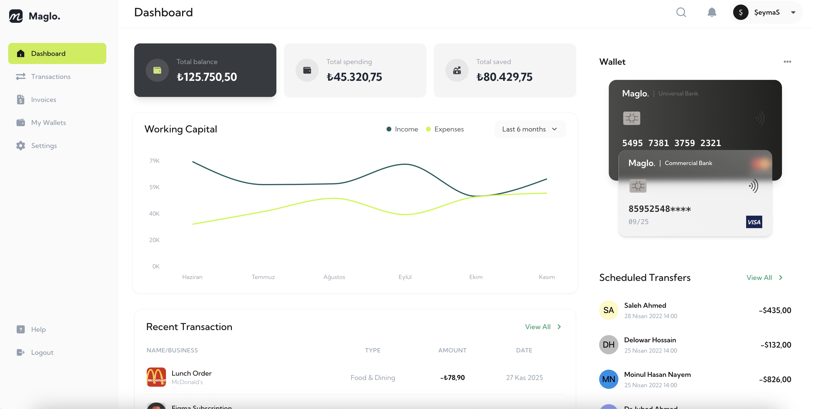

# 💰 Maglo Finance

<div align="center">



### Your friendly neighborhood finance dashboard that makes managing money less boring! 🚀

[](https://reactjs.org/)
[](https://www.typescriptlang.org/)
[](https://vitejs.dev/)
[](https://tailwindcss.com/)

</div>

---

## 🎯 What's This All About?

Maglo Finance is a sleek, modern financial management dashboard that helps you keep track of your money without falling asleep. Built with React and a sprinkle of TypeScript magic! ✨

## ✨ Features That'll Make You Go "Wow!"

- 📊 **Dashboard** - See all your financial stats at a glance (without crying)
- 💸 **Transaction Tracking** - Keep tabs on where your money goes (spoiler: probably coffee)
- 📅 **Scheduled Transfers** - Set it and forget it (responsibly, of course)
- 🧾 **Invoices Management** - Because adulting means paperwork
- 👛 **Wallet Management** - Multiple wallets? We got you!
- 📈 **Working Capital Chart** - Pretty graphs that make you look smart
- 👤 **User Profile** - Customize your experience
- ⚙️ **Settings** - Tweak things until they're just right
- 🔐 **Secure Authentication** - Your money's safer than a dragon's hoard

## 🛠️ Tech Stack (The Cool Stuff Under The Hood)

- ⚛️ **React 19** - The latest and greatest
- 📘 **TypeScript** - Because we like our bugs caught early
- ⚡ **Vite** - Lightning-fast builds that'll make you smile
- 🎨 **Tailwind CSS** - Making things pretty without the CSS headache
- 🔄 **Redux Toolkit** - State management that doesn't make you cry
- 🔍 **React Query** - Data fetching done right
- 📊 **Recharts** - Beautiful charts with minimal effort
- 🎭 **React Router** - Navigate like a pro
- 🍞 **React Hot Toast** - Notifications that pop!
- 🎯 **React Icons** - Icons for days

## 🚀 Getting Started

### Prerequisites

- Node.js (the latest one your computer can handle)
- npm or yarn (dealer's choice)
- A sense of humor (optional but recommended)

### Installation

1. Clone this bad boy:
```bash
git clone <your-repo-url>
cd maglofinance
```

2. Install the dependencies (grab a coffee, this takes a minute):
```bash
npm install
```

3. Fire up the development server:
```bash
npm run dev
```

4. Open your browser and navigate to `http://localhost:5173` 🎉

## 📜 Available Scripts

```bash
npm run dev      # Start development server (your new best friend)
npm run build    # Build for production (make it production-ready!)
npm run preview  # Preview production build (see it before it's live)
npm run lint     # Check your code (find those pesky errors)
```

## 🎨 Project Structure

```
maglofinance/
├── src/
│   ├── components/     # Reusable components (the building blocks)
│   ├── pages/          # Page components (the actual pages, duh)
│   ├── layout/         # Layout wrappers (keeping things organized)
│   ├── hooks/          # Custom React hooks (magic functions)
│   ├── store/          # Redux store setup (state central)
│   ├── types/          # TypeScript types (keeping TypeScript happy)
│   ├── utils/          # Helper functions (the unsung heroes)
│   └── assets/         # Images, icons, etc. (the pretty stuff)
├── public/             # Static files (don't touch unless you know what you're doing)
└── README.md          # You are here! 👋
```

## 🌟 Key Features Breakdown

### 💳 Balance Cards
View your available balance, pending amounts, and total transactions in one beautiful view.

### 📊 Working Capital Chart
Visualize your financial flow with interactive charts that actually make sense.

### 🔄 Recent Transactions
Keep track of your latest financial activities with real-time updates.

### 👛 Multi-Wallet Support
Manage multiple wallets (Bitcoin, PayPal, or whatever floats your boat).

### ⏰ Scheduled Transfers
Schedule transfers and let the app handle the rest. Time travel for your money!

## 🎭 Pages Overview

| Route | Description |
|-------|-------------|
| `/dashboard` | Your financial command center |
| `/transactions` | All your money moves in one place |
| `/transactions/scheduled` | Upcoming transfers |
| `/invoices` | Invoice management central |
| `/wallets` | Your digital wallet collection |
| `/profile` | Make it yours |
| `/settings` | Tweak all the things |
| `/help` | When you need a hand |

## 🔐 Authentication

Secure sign-in and sign-up flows keep your data safe. We take security seriously (but not ourselves).

## 🎨 Styling

Built with Tailwind CSS for that modern, clean look. Responsive design means it looks great on everything from your phone to your ultrawide monitor!

## 🤝 Contributing

Found a bug? Want to add a feature? Contributions are welcome! Just:

1. Fork it
2. Create your feature branch (`git checkout -b feature/AmazingFeature`)
3. Commit your changes (`git commit -m 'Add some AmazingFeature'`)
4. Push to the branch (`git push origin feature/AmazingFeature`)
5. Open a Pull Request

## 📝 License

This project is private and for personal/educational use. All rights reserved.

## 🙏 Acknowledgments

- Coffee ☕ - for the late-night coding sessions
- Stack Overflow - for saving us when we had no idea what we were doing
- The React team - for making our lives easier
- You - for checking out this project!


---

<div align="center">

Made with ❤️ and lots of ☕

✨

</div>
